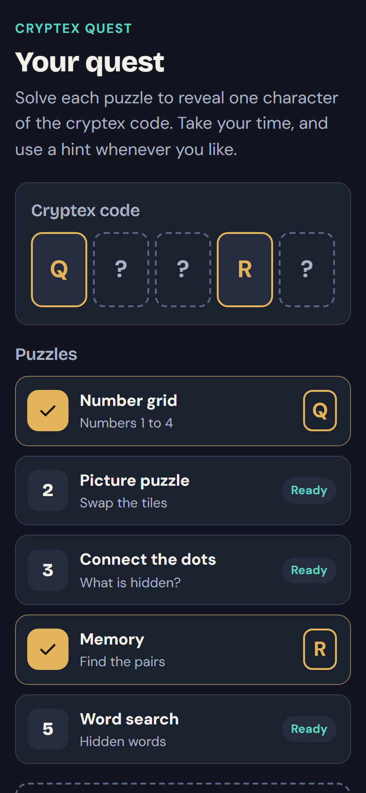
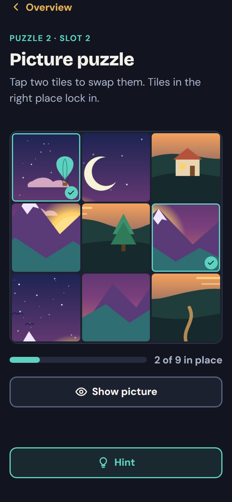
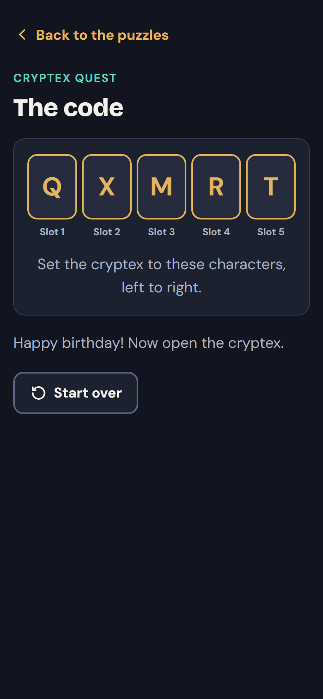

# cryptex-quest

[](https://github.com/simuuh/cryptex-quest/actions/workflows/ci.yml)

A small, static, mobile-first puzzle web app that goes with a physical **cryptex** gift.

The recipient scans a QR code, solves a few short puzzles, and each solved puzzle reveals one character of the cryptex code in its fixed slot. At the end the full code is shown, ready to dial in.

Everything is configured in **one file**. There is no build step and no backend, and it runs on any static web host.

<p>
  
  
  
</p>

> 3D-printable cryptex model: [https://www.printables.com/model/28937-cryptex-5-6-7-8-or-10-letter-wheels](https://www.printables.com/model/28937-cryptex-5-6-7-8-or-10-letter-wheels)

## Features

- **Five built-in puzzles**: a 4×4 sudoku, a picture tile-swap puzzle, connect-the-dots, memory and a word search.
- **One config file** sets the code, the puzzles, the texts, the language and the colors.
- **Zero frustration by design.** Nothing ever says "wrong". Clashes are tinted softly, correct tiles lock in, the hint button is always there, and a "skip, get the character anyway" button appears after a configurable time.
- **Free or sequential order.** Each character always lands in its own slot, whichever order the puzzles are solved in.
- **Built for phones.** It works from 360px wide, uses touch targets of at least 44px, needs no hover, and supports drag and tap.
- **Accessible.** It uses real buttons with labels, visible focus, 4.5:1 contrast and live announcements, and it respects `prefers-reduced-motion`.
- **English and German** ship with the app. Other languages need one extra file.
- **Private.** There is no tracking, no cookies, no CDN and no server. Progress is stored only in the browser.
- **Plain HTML, CSS and vanilla JS (ES modules).** Bootstrap 5 and the fonts are vendored in the repo.

## Quick start

1. **Download** or clone this repository.
2. **Create your config.** Copy `config.example.js` to `config.js`. `config.js` is in `.gitignore`, so your real code never ends up in a public repo. If `config.js` is missing, the app uses the example.
3. **Set the code and puzzles.** Put your cryptex code in `code` and add one puzzle per character to `puzzles`. Every option is explained in the comments of `config.example.js`.
4. **Add your own photo** (optional). Put it into `assets/custom/` and point the image puzzle to it, for example `image: 'assets/custom/holiday.jpg'`. See [Using your own photo](#using-your-own-photo).
5. **Test locally.** Run `node tools/serve.js` and open <http://localhost:8000>. Opening the HTML files directly (`file://`) does not work, because browsers block ES modules there.
6. **Upload the folder** to any static host (FTP web space, GitHub Pages, Netlify, …). See [docs/deployment.md](docs/deployment.md).
7. **Make a QR code** for the URL with any QR generator, print it and put it with the gift.

If something in the config is wrong, the app shows a friendly page that lists what to fix, for example: *The code "QXMR" has 4 characters but there are 3 puzzles.*

## Config reference

| Key | Type | Default | Description |
| --- | --- | --- | --- |
| `code` | text | (required) | The cryptex code, 3 to 8 characters with no spaces. Character *i* is revealed by puzzle *i*. |
| `puzzles` | list | (required) | One entry per code character, in slot order (see below). |
| `recipientName` | text | `''` | Shown in the headline ("Alex, your quest"). |
| `title` | text | `''` | Replaces the headline and the browser tab title. |
| `intro` | text | `''` | Text under the headline. An empty value uses the built-in text. |
| `outro` | text | `''` | Extra text on the final page, for example "Happy birthday!". |
| `language` | `'en'` \| `'de'` | `'en'` | UI language. |
| `theme.mode` | `'dark'` \| `'light'` | `'dark'` | Color scheme. |
| `theme.accent` | color | `#E3B45B` | Main highlight color. `secondary`, `background`, `surface`, `text` and `softError` can be overridden too. |
| `skipAfterSeconds` | number | `180` | Seconds before the skip button appears. `0` means never. The timer survives reloads. |
| `freeOrder` | boolean | `true` | `true`: any order. `false`: puzzles unlock one after another. |
| `seed` | text | the code | Change it to get different puzzle layouts with the same code. |

### Using your own photo

- **Where:** put the file into `assets/custom/`, for example `assets/custom/holiday.jpg`, and set `image: 'assets/custom/holiday.jpg'` in `config.js`. Everything in `assets/custom/` is ignored by git, so personal photos are never committed. Upload that folder together with the app.
- **Size:** about **1200 px** on the short side and **under 300 KB** (JPG or WebP, quality around 80). Bigger files only make the page slower on mobile data; the puzzle never uses more than 1200 px.
- **Shape:** any shape works. The photo is center-cropped to a square, so keep the important part in the middle.
- **Rotation:** photos straight from a phone are shown upright. The EXIF orientation is respected.
- **Path rules:** the path must be relative and inside `assets/`. If the file is missing or cannot be read, the puzzle shows the placeholder picture and the browser console explains why (for example *"assets/custom/holiday.jpg" could not be loaded (HTTP 404)*). Check spelling and capitalization: many hosts treat `Holiday.JPG` and `holiday.jpg` as different files.
- Memory cards can use photos too (`pairs: ['assets/custom/dog.jpg', ...]`); small square images of about 300 px work best.

### Puzzle entries

```js
{ type: 'memory', title: 'Our holiday', subtitle: 'Find the pairs', options: { pairs: ['🏖️', '⛰️', '🍦'] } }
```

`title`, `subtitle` and `instruction` are optional overrides of the built-in texts.

| Type | Options |
| --- | --- |
| `sudoku` | `difficulty`: `'easy'` (8 givens), `'medium'` (6) or `'hard'` (the fewest that still give a unique solution) |
| `image` | `image`: a relative path inside `assets/`, such as `'assets/custom/photo.jpg'` (default: the placeholder). `size`: `3` or `4` tiles per side |
| `dots` | `points`: `[[x, y], ...]` on a 100×100 board, in order. `closed`: connect the last dot to the first. `name`: what the shape is ("a heart"). Keep dots about 14 units apart. |
| `memory` | `pairs`: 2 to 10 emoji, short words or image paths |
| `wordsearch` | `words`: 1 to 8 words of 3 or more letters. `size`: 6 to 10 (default 8, which is easiest on phones). `backwards`: also allow reversed words |

## Adding a puzzle

A new puzzle type is **one file plus one config entry**. Create `js/puzzles/<type>.js` with a default export `{ id, title, mount(container, options, api) }`, then use `type: '<type>'` in the config. The full interface and a copy-paste template are in [docs/adding-a-puzzle.md](docs/adding-a-puzzle.md).

## Deployment

Any static host works, because the app is just files with relative paths. Use **HTTPS**: some mobile browsers clear or block `localStorage` on plain-HTTP pages, which would lose progress. Details, including GitHub Pages and FTP, are in [docs/deployment.md](docs/deployment.md).

## Privacy

- No analytics, no tracking, no cookies, no external requests. Fonts and CSS are served from your own host.
- Progress (which puzzles are solved) is stored only in the recipient's browser (`localStorage`). If storage is blocked (rare, some strict privacy modes), the app still works, but it keeps progress only in memory, so it is forgotten whenever a new page loads. The overview page shows a short notice in that case.
- Pages carry `noindex` and `no-referrer` meta tags, so search engines are asked not to list your quest.

## An honest note on security

This is a gift toy, not a safe. **In the normal setup, the code is visible to anyone who reads the page source** (`config.js` is loaded by the browser). The puzzles are there for fun, not to protect anything. Don't reuse a code that guards something valuable, and don't put personal data into the config if the URL is public, unless you use private mode (below).

## Private mode (optional)

To publish your quest on a public host without exposing the code, the texts or your photos, build an encrypted copy:

```sh
node tools/build-private.mjs --url https://your-domain.example/quest/   # add --pin for a PIN
```

This writes `dist/` with `config.enc` and encrypted photos (AES-256-GCM), and prints a share link with the key after `#k=`. It also writes a QR code of that link to `qr.png` and `qr.svg`. The browser decrypts everything locally, and the host never sees the key. Anyone with the full link can open the quest, and a link cannot be revoked except by building again with a new key. [docs/private-mode.md](docs/private-mode.md) explains the threat model, deployment and printing the QR code.

`node tools/check-private.mjs` checks that no personal files (`config.js`, `assets/custom/`, `dist/`, `*.enc`, `qr.*`) are tracked by git.

## Development

```sh
node tools/serve.js   # local server on http://localhost:8000
npm test              # runs node --test, no dependencies needed
```

The puzzle logic (sudoku generation and validation, tile ordering, dot connecting, memory reducer, word placement) and the state, config, i18n and routing helpers are small pure modules in `js/logic/` and `js/lib/`, covered by tests in `tests/`.

```
index.html  puzzle.html  done.html   pages (thin HTML shells)
config.example.js                    documented example config
css/        bootstrap.min.css, theme.css (tokens), puzzles.css
fonts/      Bricolage Grotesque + DM Sans (OFL)
js/core.js  config loading + validation, puzzle registry, i18n, theme, state store
js/lib/     pure helpers (state, config, rng, i18n, routing, crypto, private mode) and small DOM/UI helpers
js/logic/   pure puzzle logic (tested)
js/puzzles/ one UI module per puzzle type
js/pages/   one script per page
js/i18n/    en.js, de.js
assets/     generated placeholder art (license-free)
tools/      serve.js (local server), build-private.mjs (encrypted build),
            check-private.mjs (repo hygiene), qr-code.mjs (QR encoder)
tests/      node --test suites
```

## License

[MIT](LICENSE) for the code. Bootstrap is MIT. Bricolage Grotesque and DM Sans are under the SIL Open Font License 1.1 (see `fonts/`). The placeholder images in `assets/` were drawn for this project and are covered by the MIT license.

## Contributing

Issues and pull requests are welcome, especially new puzzle types and translations.

- Keep it dependency-free and build-free.
- Put logic in a pure module under `js/logic/` with a test in `tests/`.
- UI text goes through the i18n tables. Please add English and German.
- Run `npm test` and check the pages at 360px width before opening a PR.
